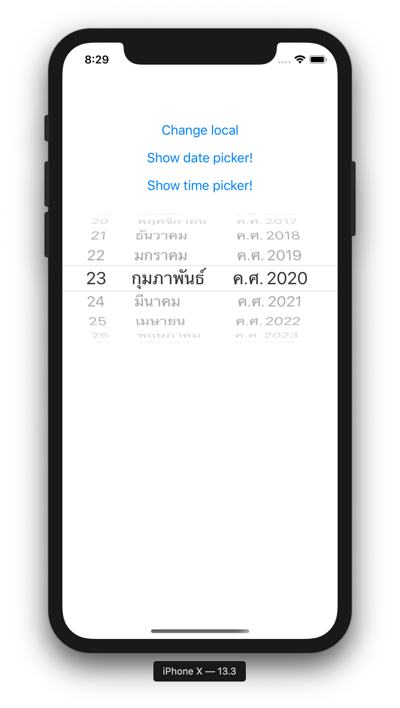

# Expo DateTimePicker Demo


## Environment 

- Expo CLI Version: `3.13.1`
- Node Version: `v12.14.1`
- NPM Version: `6.13.6`
- Yarn Version: `1.21.1`


## Dependencies

- [date-time-picker](https://docs.expo.io/versions/latest/sdk/date-time-picker/)


## Install
`expo install @react-native-community/datetimepicker`


## Run Application

```shell script
# run ios
yarn run ios

# run android
yarn run android
```


## Demo


